**Manual do Usuário**

O **Sistema Mandacaru** é um sistema de controle e gerenciamento de quota de impressão. Foi desenvolvido com o intuído de gerenciar e promover o consumo consciente e sustentável de papel e Toner no IFNMG campus Araçuaí. A Figura 01 relata o diagrama de navegação do Mandacaru.

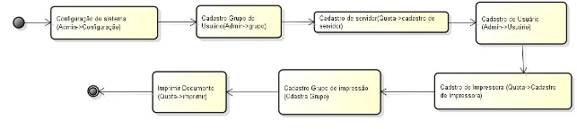

Figura 01

A Figura 2, apresenta a tela inicial do sistema . Antes de iniciar a utilização do sistema é necessário configurar o mesmo. Isso é feito no submenu Admin.

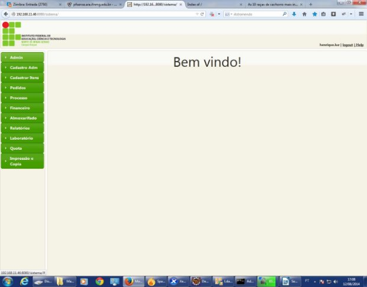

Figura PAGE2

Ao clicar no item configurações, aparecerá a tela, onde o usuário poderá realizar a configuração do sistema, como mostra a figura 02. 

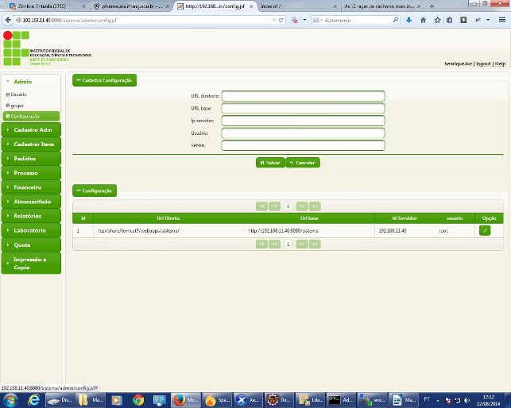

Figura 03

- **O campo URL diretório**: define o diretório do sistema operacional onde se encontra os arquivos  do  sistema  de  impressão.  Por  exemplo:  a  pasta /usr/share/tomcat7/webapps/sistema/ é o diretório onde se encontra os arquivos do sistema no servidor de teste. Sendo que, o sistema operacional dessa máquina é o debian 6 . 
- **URL base:**  É url de acesso ao sistema , que engloba o ip ou domínio do servidor , porta de acesso e o nome do diretório do sistema. Por exemplo <http://192.168.11.46:8080/sistema>.
- **IP do servidor**: Endereço ip do servidor onde está hospedada a aplicação.
- **Usuário**: usuário root do sistema operacional linux , onde que está instalado o sistema .

- **Senha** : senha do usuário root do sistema operacinal.

Feita a configuração do sistema , deverá ser realizado a criação dos grupos da aplicação. Isso é feito no menu Admin->grupo. Como mostra a Figura 04.

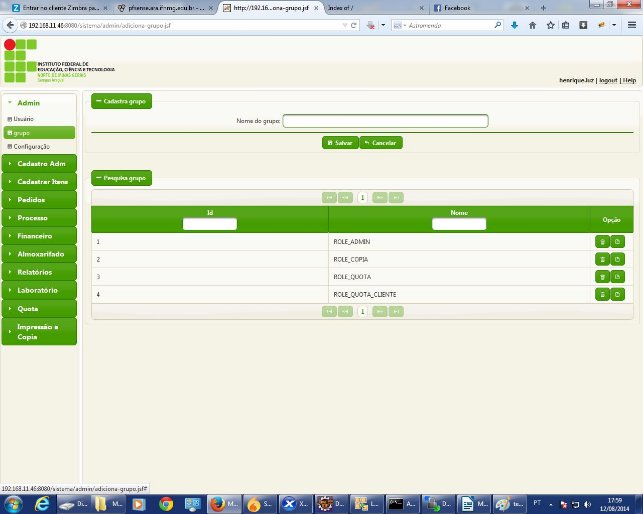

Figura 04

Os grupos deverão ser criados obrigatoriamente com os seguintes nomes: **ADMIN, QUOTA e QUOTA\_CLIENTE.**

**ROLE\_ADMIN:** possui acesso total ao sistema.

**QUOTA:** possui acesso total ao menu Quota, que engloba: cadastrar impressora, cadastrar grupo de impressão, verificar relatório de cópias e cadastrar Servidor.

**QUOTA\_CLIENTE:** só possui a funcionalidade de imprimir documentos.

Após a configuração do sistema e criação dos grupos é necessário criar um usuário administrador . Para isso, entre no menu Quota->Cadastrar servidor

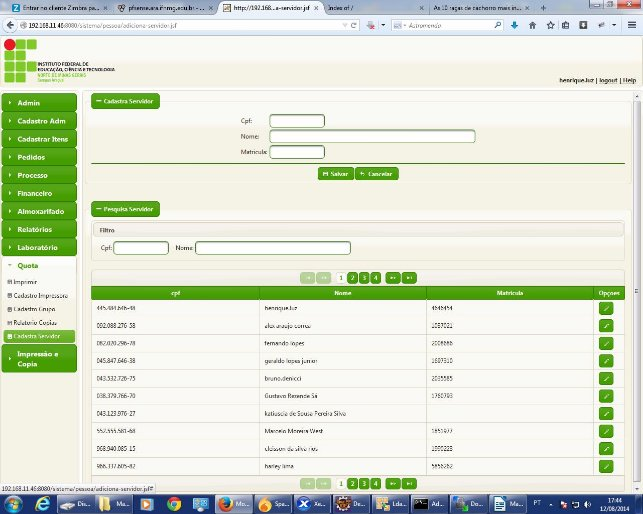

Figura 05

Para cadastrar um novo servidor, é preciso coletar os CPF, nome e matricula do SIAPE. Ainda nessa mesma tela, é possível alterar informações do servidor em opções , no ícone Editar.  Conforme pode ser visto nas Figuras 05 e 06.

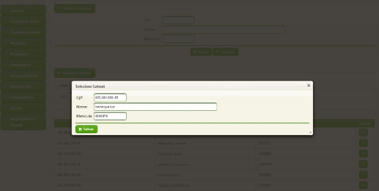

Figura PAGE6

Após o cadastro do servidor, deve ser criado um usuário relacionado a esse,  para que ele possa acessar o sistema e realizar suas tarefas, de acordo com o grupo defino. Esse cadastro é feito em Admin->Usuário. Como mostra a tela da Figura 07.

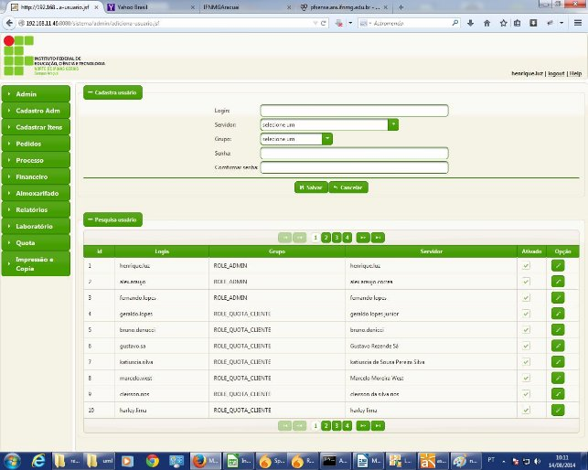

Figura07

Criando os grupos e o usuário Administrador, é hora de alterar a configuração do spring security. Esse framework é responsável por prover a segurança ao acesso dos arquivos no servidor de aplicação. O XML de configuração se localiza em … /webapps/sistema/WebContent/WEB-INF/applicationContext.xml, abaixo é apresentado o conteúdo desse arquivo:

<?xml version="1.0" encoding="UTF-8"?>

<beans:beans xmlns="http://www.springframework.org/schema/security" xmlns:xsi="http://www.w3.org/2001/XMLSchema-instance" xmlns:beans="http://www.springframework.org/schema/beans" xsi:schemaLocation="http://www.springframework.org/schema/beans http://www.springframework.org/schema/beans/spring-beans.xsd http://www.springframework.org/schema/security http://www.springframework.org/schema/security/spring-security-3.0.xsd">

<http auto-config="true" use-expressions="true" > <session-management invalid-session-url="/login.jsf"  />

<form-login login-page="/login.jsf" authentication-failure- url="/login.jsf?error=true" />

<intercept-url pattern="/admin/\*\*" access="hasAnyRole('ROLE\_ADMIN')" />

<intercept-url  access="isAuthenticated()" pattern="/init/\*\*" />

<intercept-url pattern="/pedidos/\*\*" access="hasAnyRole('ROLE\_ADMIN')" />

<intercept-url pattern="/docImpressao/\*\*" access="hasAnyRole('ROLE\_ADMIN')" />

<intercept-url pattern="/cadastroItens/\*\*" access="hasRole('ROLE\_ADMIN')" />

<intercept-url pattern="/processo/\*\*" access="hasRole('ROLE\_ADMIN')" />

<intercept-url pattern="/impressao/\*\*" access="hasAnyRole('ROLE\_COPIA','ROLE\_ADMIN')" />

<intercept-url pattern="/pessoa/\*\*" access="hasAnyRole('ROLE\_COPIA','ROLE\_ADMIN','ROLE\_QUOTA')" />

<intercept-url pattern="/quota/\*\*" access="hasAnyRole('ROLE\_COPIA','ROLE\_ADMIN','ROLE\_QUOTA')" />

<intercept-url pattern="/quota-cliente/\*\*" access="hasAnyRole('ROLE\_COPIA','ROLE\_ADMIN','ROLE\_QUOTA','ROLE\_QUOTA\_CLIENTE')

- />

<logout invalidate-session="true"  logout-success- url="/init/index.jsf" />  

<form-login authentication-failure-url="/erro.jsf" login- page="/login.jsf"/>

</http>

<beans:bean id="dataSource" class="org.springframework.jdbc.datasource.DriverManagerDataSource">

<beans:property name="url" value="jdbc:mysql://localhost:3306/compras2" /> <beans:property name="driverClassName"

value="com.mysql.jdbc.Driver" />

<beans:property name="username" value="root" />

<beans:property name="password" value="ifnmg" />

</beans:bean>

<authentication-manager>

<authentication-provider>

` `<user-service>

<user name="admin" password="admin" authorities="ROLE\_ADMIN" /> </user-service>

</authentication-provider>

</authentication-manager>

</beans:beans>

Altere a configuração do arquivo  applicationContext.xml para seguinte:

<?xml version="1.0" encoding="UTF-8"?>

<beans:beans xmlns="http://www.springframework.org/schema/security" xmlns:xsi="http://www.w3.org/2001/XMLSchema-instance" xmlns:beans="http://www.springframework.org/schema/beans" xsi:schemaLocation="http://www.springframework.org/schema/beans http://www.springframework.org/schema/beans/spring-beans.xsd http://www.springframework.org/schema/security http://www.springframework.org/schema/security/spring-security-3.0.xsd">

<http auto-config="true" use-expressions="true" > <session-management invalid-session-url="/login.jsf"  />

<form-login login-page="/login.jsf" authentication-failure- url="/login.jsf?error=true" />

<intercept-url pattern="/admin/\*\*" access="hasAnyRole('ROLE\_ADMIN')" />

<intercept-url  access="isAuthenticated()" pattern="/init/\*\*" />

<intercept-url pattern="/pedidos/\*\*" access="hasAnyRole('ROLE\_ADMIN')" />

<intercept-url pattern="/docImpressao/\*\*" access="hasAnyRole('ROLE\_ADMIN')" />

<intercept-url pattern="/cadastroItens/\*\*" access="hasRole('ROLE\_ADMIN')" />

<intercept-url pattern="/processo/\*\*" access="hasRole('ROLE\_ADMIN')" />

<intercept-url pattern="/impressao/\*\*" access="hasAnyRole('ROLE\_COPIA','ROLE\_ADMIN')" />

<intercept-url pattern="/pessoa/\*\*" access="hasAnyRole('ROLE\_COPIA','ROLE\_ADMIN','ROLE\_QUOTA')" />

<intercept-url pattern="/quota/\*\*" access="hasAnyRole('ROLE\_COPIA','ROLE\_ADMIN','ROLE\_QUOTA')" />

<intercept-url pattern="/quota-cliente/\*\*" access="hasAnyRole('ROLE\_COPIA','ROLE\_ADMIN','ROLE\_QUOTA','ROLE\_QUOTA\_CLIENTE')

- />

<logout invalidate-session="true"  logout-success- url="/init/index.jsf" />  

<form-login authentication-failure-url="/erro.jsf" login- page="/login.jsf"/>

</http>

<beans:bean id="dataSource" class="org.springframework.jdbc.datasource.DriverManagerDataSource">

<beans:property name="url" value="jdbc:mysql://localhost:3306/compras2" /> <beans:property name="driverClassName"

value="com.mysql.jdbc.Driver" />

<beans:property name="username" value="root" />

<beans:property name="password" value="ifnmg" />

</beans:bean>

<authentication-manager>

<authentication-provider>

<password-encoder hash="md5" />

<jdbc-user-service data-source-ref="dataSource" users-by-username-query="SELECT login, senha, 'true' as 

enable FROM cusuario WHERE login=?"

authorities-by-username-query="SELECT login, cgrupo.nome FROM cusuario,cgrupo WHERE  cusuario.grupo\_id=cgrupo.id and cusuario.status\_id=1 and  login=?" />

</authentication-provider>

</authentication-manager>

</beans:beans

Observe que houve alteração na tag <authentication-provider>.

Feito o cadastramento do usuário , deve-se cadastrar as impressas, pelas quais serão realizados os trabalhos de impressão. Esse procedimento é feito em Quota->Cadastro de Impressora, como mostra a Figura 08.

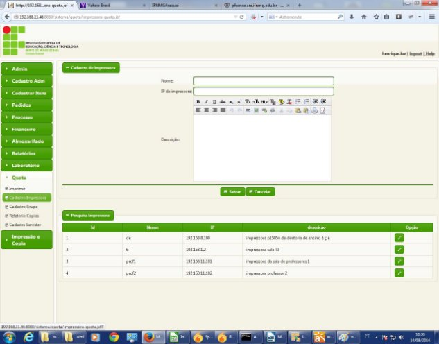

Figura 08

É necessário cadastrar o nome da impressora de forma idêntica ao nome da impressora que foi adicionado no servidor CUPS. 

Figura 09 

A Figura 09 mostra claramente , com os quadrados vermelhos, que o nome da impressora no servidor CUPS é igual ao nome cadastrado no sistema Mandacaru. Dessa forma, caso a impressora esteja  com  o  status  pronta  pra  imprimir  no  CUPS.  O  trabalho  de  impressão  funcionará adequadamente no sistema. O cadastro do IP da impressora também é importante, devido a necessidade que o sistema  possui de verificar se a impressora está na rede ou não.

Adicionar  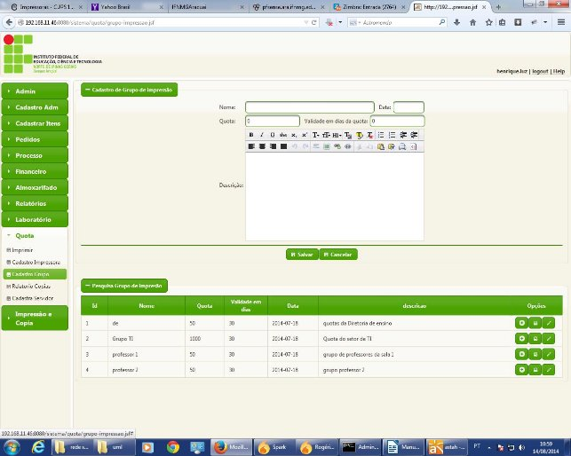Usuário

Figura 10

Com os usuários e impressoras cadastradas, é hora de cadastrar os grupos de impressão. Isso é feito em Quota->Cadastro  grupo. Como mostra a Tela da Figura 10. Abaixo é descrita a função de cada campo:

- Nome: Nome definido para o grupo.
- Data: data que será utilizada para contabilizar o início do período de quota. 
- Quota: Valor máximo de páginas que pode ser impressos em um período. 
- Validade em dias da quota: quantidade em dias que um período de quota possui.

`  `Botão  adicionar Usuário: responsável por adicionar o usuário ao grupo.

Botão Adiciona Impressora: responsável por adicionar a Impressora ao grupo.

Com os usuários e impressoras adicionados ao grupo , a opção de imprimir o documento ficará habilitada. O procedimento para impressão é bem simples . Abra o menu Quota->Imprimir , como mostra a Figura 11.

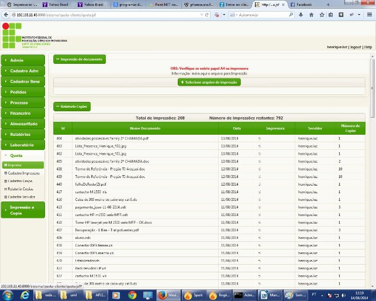

Figura 11

Pressione o botão “selecione um arquivo de impressão” e o sistema abrirá um dialog para seleção de arquivo. Após a seleção de arquivo para impressão será aberta a tela exporta de acordo com a Figura 12.

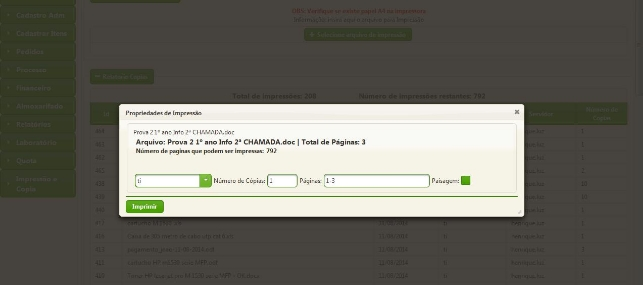

Figura 12

Na tela da Figura 12, o usuário poderá escolher a impressora para impressão, o número de cópias por página, as páginas que serão impressas e se a página vai ser impressa com o formato de paisagem ou não. 

**Cadastro de servidor LDAP**

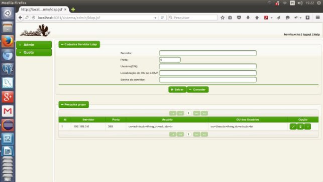

**ok**
