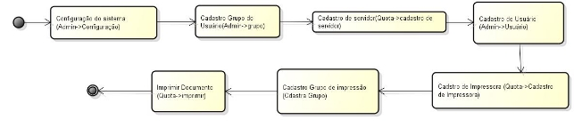
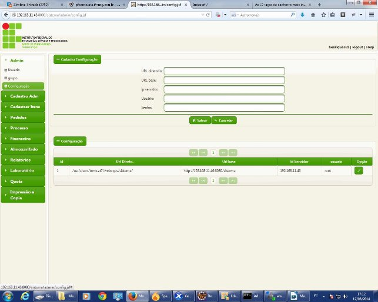
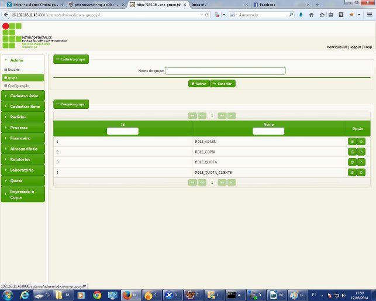
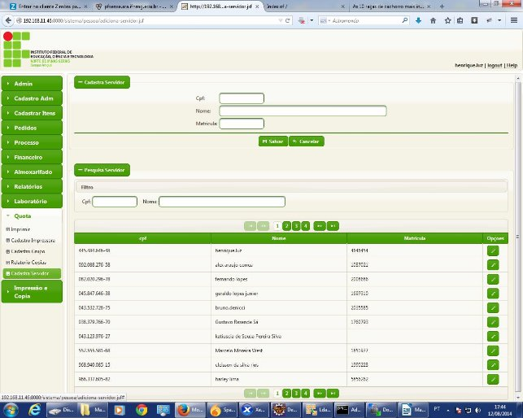
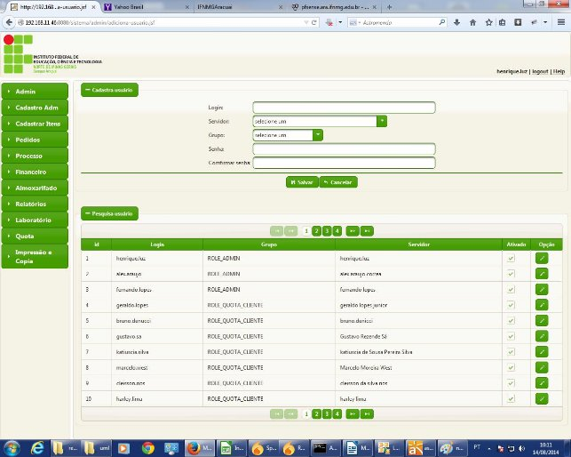
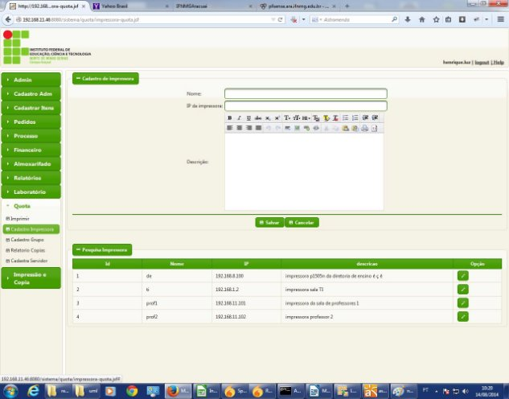
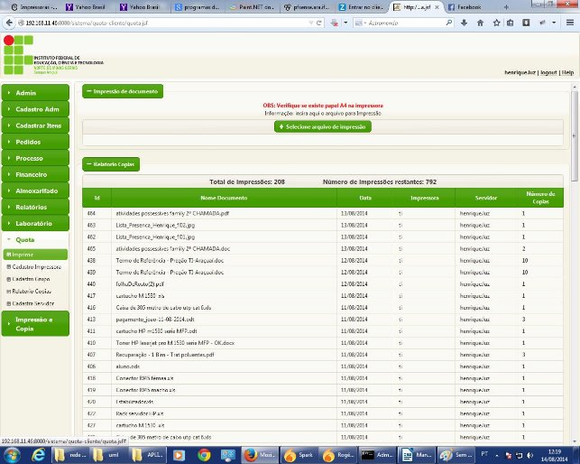
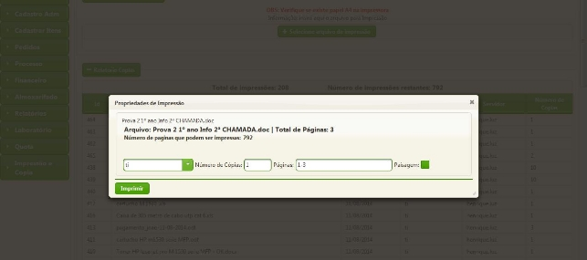

**Manual de Instalação do Sistema Mandacaru**

Roteiro :

1. instalação do cups.
1. Instalação do tomcat 7.
1. instalação do libreoffice.
1. Instalação do unoconv
1. Instalação do Mandacaru.

**Ambiente de Instalação**

A instalação do sistema foi realizada usando o sistema operacional debian-6.0.4-amd64, em um ambiente de virtualização , onde se utilizou Xen server 6.2, como hipervisor.  A configuração da máquina virtual, em que se instalou o mandacaru, possui o seguinte recurso de Hardware:

- Memória Ram  6GB.
- 4 vCPUs do Xen server 6.2.
- 20 GB de HD
- 1 network interface.

**Instalação do cups**

Considerando que o sistema debian está devidamente configurado e funcionado , vamos para o procedimento de montagem do CUPS.  A instalação do CUPS pode ser realizada através do repositório de pacotes  nativo do debian 6.0.4. Utilizando só seguinte comandos:

#*apt-get update #apt-get install cups\**

Concluída a instalação, o usuário deve acessar o cups remotamente. Isso é feito com este comando:

*#cupsctl -h 127.0.0.1:631 –remote-admin*

Para acessar o sistema de administração do cups acesse o seguinte endereço : [http://192.168.11.61:631/. O](http://192.168.11.61:631/)bserve que foi instalado a versão 1.4.4 do servidor de impressão.

**Instalação do Tomcat 7**

O tomcat 7 foi o servidor de aplicação utilizado para hospedar o sistema mandacaru. Para que, esse servidor funcione, primeiro é necessário instalar o java 7 (JRE 7). Abaixo mostra as instruções para realizar esse procedimento.

- *echo "deb h[ttp://ppa.launchpad.net/webupd8team/java/ubuntu precise](http://ppa.launchpad.net/webupd8team/java/ubuntu) main" > /etc/apt/sources.list.d/webupd8team-java.list*
- *echo "deb-src h[ttp://ppa.launchpad.net/webupd8team/java/ubuntu precise](http://ppa.launchpad.net/webupd8team/java/ubuntu) main" >> /etc/apt/sources.list.d/webupd8team-java.list*
- *apt-key adv --keyserver keyserver.ubuntu.com --recv-keys EEA14886*
- *apt-get update*
- *apt-get install oracle-java7-installer*
- *java -version*

*java version "1.7.0\_17"*

*Java(TM) SE Runtime Environment (build 1.7.0\_17-b02)*

*Java HotSpot(TM) 64-Bit Server VM (build 23.7-b01, mixed mode)*

Feito o procedimento e verificando que a versão do java é “1.7.0\_17” ou superior. É hora de instalar o tomcat 7. Para isso, execute o comando a seguir como usuário administrador.

- *cd /tmp*
- *wget http://mirror.cogentco.com/pub/apache/tomcat/tomcat-7/v7.0.55/bin/apache-*

*tomcat-7.0.55.tar.gz*

- *tar xvzf ./apache-tomcat-7.0.55.tar.gz*
\*
`           `**// mova os arquivos do tomcat 7 para  */usr/share/tomcat7* :**

- *mkdir /usr/share/tomcat7*  
- *mv /tmp/apache-tomcat-7.0.55  /usr/share/tomcat7*
\*
`           `**// criar um link simbólico tomcat para /usr/share/tomcat7** 

- *rm -f /usr/share/tomcat* 
- *ln -s /usr/share/tomcat7/apache-tomcat-7.0.37 /usr/share/tomcat*

Ao termino da configuração do tomcat 7, no intuito de facilitar a vida do administrador de rede, pode se cria um arquivo de inicialização no diretório  /etc/init.d. Esse script de inicialização é apresentada no trecho de código abaixo. 

- cd /etc/init.d/

`          `**//pode ser usado qualquer editor de texto no debian 6**

- vim /etc/init.d/tomcat 7

`           `**//escreva o  código abaixo no arquivo** 

*#!/bin/sh*

- *Provides: Tomcat*
- *Required-Start: $network*
- *Required-Stop: $network*
- *Default-Start: 2 3 5*
- *Description: Java Servlet and JSP Engine ### END INIT INFO*

 **/etc/init.d/tomcat 7** 

*case "$1" in 'start')*

`  `*/usr/share/tomcat/bin/startup.sh*

`    `*;;*

*'stop')*

`   `*/usr/share/tomcat/bin/shutdown.sh*

`    `*;;*

*\*)*

*echo "Usage: $0 { start | stop }"     ;;*

*esac*

*exit 0*

Também é necessário que o tomcat 7 seja inicializado junto do sistema operacional. Isso é feito modificando o aquivo /etc/rc.local . Como mostra os trecho abaixo.

- *vim /etc/rc.local*
\*
`           `**// editra o arquivo /etc/rc.local**

*#!/bin/sh -e*

*#*

- *rc.local*

*#*

- *This script is executed at the end of each multiuser runlevel.*
- *Make sure that the script will "exit 0" on success or any other*
- *value on error.*

*#*

- *In order to enable or disable this script just change the execution*
- *bits.*

*#*

- *By default this script does nothing.*

*/usr/share/tomcat/bin/startup.sh exit 0*

**Instalação do libreoffice**

Faça download do LibreOffice no site oficial htt[ps://pt-br.libreoffice.org/. A ](https://pt-br.libreoffice.org/)versão utilizada foi : LibreOffice\_4.2.4\_Linux\_x86-64\_deb.tar.gz. Após o download do programa siga as seguintes instruções . 

- tar zxvf LibreOffice\_4.2.4\_Linux\_x86-64\_deb.tar.gz
- cd  LibreOffice\_4.2.4.2\_Linux\_x86-64\_deb
- cd DEBS/ 
- sudo dpkg -i \*.deb

**Instalação do unoconv**

O unoconv é um conversor de arquivo. A utilidade dele no sistema Mandacaru é converter todos só arquivos que são enviados para PDF. Com intuito de facilitar o trabalho de contabilidade de impressão. Abaixo e mostra o procedimento de instalação do unoconv.

- *apt-get update*

`           `*// caso seu sistema operacional não possua o programa git instale-o  “apt-get install git”*

- *cd /tmp*
- *git clone https://github.com/dagwieers/unoconv*
- *cd unoconv/*

`           `*// caso seu sistema operaciona não possua o make instale-o “apt-get install make”*

- *make install*
- *cd ../*
- *rm -rf unoconv/*
- *unoconv --listener &*

Para deamonizer o unoconv (mais prático no servidor), crie o arquivo /etc/init.d/unoconvd com o conteúdo abaixo: 

*#!/bin/sh*

\### BEGIN INIT INFO

- Provides: unoconvd
- Required-Start: $network
- Required-Stop: $network
- Default-Start: 2 3 5
- Default-Stop:
- Description: unoconvd - Converting documents to PDF by unoconv ### END INIT INFO

case "$1" in

start)

/usr/bin/unoconv --listener &

`         `;;

stop)

killall soffice.bin          ;;

restart)

killall soffice.bin

`         `sleep 1

/usr/bin/unoconv --listener &          ;;

esac

Ajuste permissões, coloque para carregamento no boot e rode o daemon:

- chmod 755 /etc/init.d/unoconvd
- update-rc.d  unoconvd defaults
- service unoconvd start

**Instalação do Mandacaru**

Com todas as pendências instaladas e funcionando chegou a hora de realizar o deploy do sistema Mandacaru . Mas antes disso, é preciso realizar algumas configurações no tomcat 7. Primeiramente iremos configura o acesso ao sistema de gerenciamento de apps do servidor de aplicação. 

//Edite o arquivo arquivos

- vim  /usr/share/tomcat/conf/tomcat-users.xml

// o aquivo tomcat-users.xml tem que possuir configuração semelhante a está <?xml version='1.0' encoding='utf-8'?>

<tomcat-users>

`  `<role rolename="manager-gui"/>

`  `<role rolename="admin-gui"/>

` `<user username="ifnmg" password="ifnmg" roles="manager-gui, admin-gui"/>

</tomcat-users>

Para melhorar a performance do tomcat 7 , com o intuito de deixá-lo  mais robusto e rápido. Faremos algumas configurações de desempenho. É importante levar em consideração que as configuração  que serão descritas agora, leva em consideração a configuração da máquina de teste que é: Memória Ram  6GB, 4 vCPUs do Xen server 6.2 e 20 GB de HD. Caso, os recursos de hardware da sua máquina forem menores, é aconselhável readequar as configurações de performance. 

//aumentar a memoria vm java

//edite o aquivo /sh 

- vim /usr/share/tomcat/bin/catalina.sh

//adicione o comando abaixo na primeira linha do arquivo catalina.sh JAVA\_OPTS="-Xms3024m -Xmx3024m -XX:PermSize=1500m -XX:MaxPermSize=1500m -server".

Feito isso podemos realizar o deplye do aquivo sistema.war , que  é o código fonte do sistema Mandacaru. Esse procedimento pode ser feito através da GUI de administração do tomcat , acessando http://ipdoservidor:8080. O Tomcat possui um valor default máximo para o uploload de arquivo de deplye, que no caso é 2 MB. Para desabilitar isso, basta ir no arquivo usr/share/tomcat/conf/server.xml. E utilizar a tag maxPostSize="-1"

<Connector ... maxPostSize="-1"> 

Para mais informações sobre uso e configuração do Mandacaru leio o Manual do usário.
  
  
  
  **Manual do Usuário**

O **Sistema Mandacaru** é um sistema de controle e gerenciamento de quota de impressão. Foi desenvolvido com o intuído de gerenciar e promover o consumo consciente e sustentável de papel e Toner no IFNMG campus Araçuaí. A Figura 01 relata o diagrama de navegação do Mandacaru.

Figura 01

A Figura 2, apresenta a tela inicial do sistema . Antes de iniciar a utilização do sistema é necessário configurar o mesmo. Isso é feito no submenu Admin.

Figura PAGE2

Ao clicar no item configurações, aparecerá a tela, onde o usuário poderá realizar a configuração do sistema, como mostra a figura 02. 

Figura 03

- **O campo URL diretório**: define o diretório do sistema operacional onde se encontra os arquivos  do  sistema  de  impressão.  Por  exemplo:  a  pasta /usr/share/tomcat7/webapps/sistema/ é o diretório onde se encontra os arquivos do sistema no servidor de teste. Sendo que, o sistema operacional dessa máquina é o debian 6 . 
- **URL base:**  É url de acesso ao sistema , que engloba o ip ou domínio do servidor , porta de acesso e o nome do diretório do sistema. Por exemplo <http://192.168.11.46:8080/sistema>.
- **IP do servidor**: Endereço ip do servidor onde está hospedada a aplicação.
- **Usuário**: usuário root do sistema operacional linux , onde que está instalado o sistema .

- **Senha** : senha do usuário root do sistema operacinal.

Feita a configuração do sistema , deverá ser realizado a criação dos grupos da aplicação. Isso é feito no menu Admin->grupo. Como mostra a Figura 04.

Figura 04

Os grupos deverão ser criados obrigatoriamente com os seguintes nomes: **ADMIN, QUOTA e QUOTA\_CLIENTE.**

**ROLE\_ADMIN:** possui acesso total ao sistema.

**QUOTA:** possui acesso total ao menu Quota, que engloba: cadastrar impressora, cadastrar grupo de impressão, verificar relatório de cópias e cadastrar Servidor.

**QUOTA\_CLIENTE:** só possui a funcionalidade de imprimir documentos.

Após a configuração do sistema e criação dos grupos é necessário criar um usuário administrador . Para isso, entre no menu Quota->Cadastrar servidor

Figura 05

Para cadastrar um novo servidor, é preciso coletar os CPF, nome e matricula do SIAPE. Ainda nessa mesma tela, é possível alterar informações do servidor em opções , no ícone Editar.  Conforme pode ser visto nas Figuras 05 e 06.

Figura PAGE6

Após o cadastro do servidor, deve ser criado um usuário relacionado a esse,  para que ele possa acessar o sistema e realizar suas tarefas, de acordo com o grupo defino. Esse cadastro é feito em Admin->Usuário. Como mostra a tela da Figura 07.

Figura07

Criando os grupos e o usuário Administrador, é hora de alterar a configuração do spring security. Esse framework é responsável por prover a segurança ao acesso dos arquivos no servidor de aplicação. O XML de configuração se localiza em … /webapps/sistema/WebContent/WEB-INF/applicationContext.xml, abaixo é apresentado o conteúdo desse arquivo:

<?xml version="1.0" encoding="UTF-8"?>

<beans:beans xmlns="http://www.springframework.org/schema/security" xmlns:xsi="http://www.w3.org/2001/XMLSchema-instance" xmlns:beans="http://www.springframework.org/schema/beans" xsi:schemaLocation="http://www.springframework.org/schema/beans http://www.springframework.org/schema/beans/spring-beans.xsd http://www.springframework.org/schema/security http://www.springframework.org/schema/security/spring-security-3.0.xsd">

<http auto-config="true" use-expressions="true" > <session-management invalid-session-url="/login.jsf"  />

<form-login login-page="/login.jsf" authentication-failure- url="/login.jsf?error=true" />

<intercept-url pattern="/admin/\*\*" access="hasAnyRole('ROLE\_ADMIN')" />

<intercept-url  access="isAuthenticated()" pattern="/init/\*\*" />

<intercept-url pattern="/pedidos/\*\*" access="hasAnyRole('ROLE\_ADMIN')" />

<intercept-url pattern="/docImpressao/\*\*" access="hasAnyRole('ROLE\_ADMIN')" />

<intercept-url pattern="/cadastroItens/\*\*" access="hasRole('ROLE\_ADMIN')" />

<intercept-url pattern="/processo/\*\*" access="hasRole('ROLE\_ADMIN')" />

<intercept-url pattern="/impressao/\*\*" access="hasAnyRole('ROLE\_COPIA','ROLE\_ADMIN')" />

<intercept-url pattern="/pessoa/\*\*" access="hasAnyRole('ROLE\_COPIA','ROLE\_ADMIN','ROLE\_QUOTA')" />

<intercept-url pattern="/quota/\*\*" access="hasAnyRole('ROLE\_COPIA','ROLE\_ADMIN','ROLE\_QUOTA')" />

<intercept-url pattern="/quota-cliente/\*\*" access="hasAnyRole('ROLE\_COPIA','ROLE\_ADMIN','ROLE\_QUOTA','ROLE\_QUOTA\_CLIENTE')

- />

<logout invalidate-session="true"  logout-success- url="/init/index.jsf" />  

<form-login authentication-failure-url="/erro.jsf" login- page="/login.jsf"/>

</http>

<beans:bean id="dataSource" class="org.springframework.jdbc.datasource.DriverManagerDataSource">

<beans:property name="url" value="jdbc:mysql://localhost:3306/compras2" /> <beans:property name="driverClassName"

value="com.mysql.jdbc.Driver" />

<beans:property name="username" value="root" />

<beans:property name="password" value="ifnmg" />

</beans:bean>

<authentication-manager>

<authentication-provider>

` `<user-service>

<user name="admin" password="admin" authorities="ROLE\_ADMIN" /> </user-service>

</authentication-provider>

</authentication-manager>

</beans:beans>

Altere a configuração do arquivo  applicationContext.xml para seguinte:

<?xml version="1.0" encoding="UTF-8"?>

<beans:beans xmlns="http://www.springframework.org/schema/security" xmlns:xsi="http://www.w3.org/2001/XMLSchema-instance" xmlns:beans="http://www.springframework.org/schema/beans" xsi:schemaLocation="http://www.springframework.org/schema/beans http://www.springframework.org/schema/beans/spring-beans.xsd http://www.springframework.org/schema/security http://www.springframework.org/schema/security/spring-security-3.0.xsd">

<http auto-config="true" use-expressions="true" > <session-management invalid-session-url="/login.jsf"  />

<form-login login-page="/login.jsf" authentication-failure- url="/login.jsf?error=true" />

<intercept-url pattern="/admin/\*\*" access="hasAnyRole('ROLE\_ADMIN')" />

<intercept-url  access="isAuthenticated()" pattern="/init/\*\*" />

<intercept-url pattern="/pedidos/\*\*" access="hasAnyRole('ROLE\_ADMIN')" />

<intercept-url pattern="/docImpressao/\*\*" access="hasAnyRole('ROLE\_ADMIN')" />

<intercept-url pattern="/cadastroItens/\*\*" access="hasRole('ROLE\_ADMIN')" />

<intercept-url pattern="/processo/\*\*" access="hasRole('ROLE\_ADMIN')" />

<intercept-url pattern="/impressao/\*\*" access="hasAnyRole('ROLE\_COPIA','ROLE\_ADMIN')" />

<intercept-url pattern="/pessoa/\*\*" access="hasAnyRole('ROLE\_COPIA','ROLE\_ADMIN','ROLE\_QUOTA')" />

<intercept-url pattern="/quota/\*\*" access="hasAnyRole('ROLE\_COPIA','ROLE\_ADMIN','ROLE\_QUOTA')" />

<intercept-url pattern="/quota-cliente/\*\*" access="hasAnyRole('ROLE\_COPIA','ROLE\_ADMIN','ROLE\_QUOTA','ROLE\_QUOTA\_CLIENTE')

- />

<logout invalidate-session="true"  logout-success- url="/init/index.jsf" />  

<form-login authentication-failure-url="/erro.jsf" login- page="/login.jsf"/>

</http>

<beans:bean id="dataSource" class="org.springframework.jdbc.datasource.DriverManagerDataSource">

<beans:property name="url" value="jdbc:mysql://localhost:3306/compras2" /> <beans:property name="driverClassName"

value="com.mysql.jdbc.Driver" />

<beans:property name="username" value="root" />

<beans:property name="password" value="ifnmg" />

</beans:bean>

<authentication-manager>

<authentication-provider>

<password-encoder hash="md5" />

<jdbc-user-service data-source-ref="dataSource" users-by-username-query="SELECT login, senha, 'true' as 

enable FROM cusuario WHERE login=?"

authorities-by-username-query="SELECT login, cgrupo.nome FROM cusuario,cgrupo WHERE  cusuario.grupo\_id=cgrupo.id and cusuario.status\_id=1 and  login=?" />

</authentication-provider>

</authentication-manager>

</beans:beans

Observe que houve alteração na tag <authentication-provider>.

Feito o cadastramento do usuário , deve-se cadastrar as impressas, pelas quais serão realizados os trabalhos de impressão. Esse procedimento é feito em Quota->Cadastro de Impressora, como mostra a Figura 08.

Figura 08

É necessário cadastrar o nome da impressora de forma idêntica ao nome da impressora que foi adicionado no servidor CUPS. 

Figura 09 

A Figura 09 mostra claramente , com os quadrados vermelhos, que o nome da impressora no servidor CUPS é igual ao nome cadastrado no sistema Mandacaru. Dessa forma, caso a impressora esteja  com  o  status  pronta  pra  imprimir  no  CUPS.  O  trabalho  de  impressão  funcionará adequadamente no sistema. O cadastro do IP da impressora também é importante, devido a necessidade que o sistema  possui de verificar se a impressora está na rede ou não.

Adicionar  Usuário

Figura 10

Com os usuários e impressoras cadastradas, é hora de cadastrar os grupos de impressão. Isso é feito em Quota->Cadastro  grupo. Como mostra a Tela da Figura 10. Abaixo é descrita a função de cada campo:

- Nome: Nome definido para o grupo.
- Data: data que será utilizada para contabilizar o início do período de quota. 
- Quota: Valor máximo de páginas que pode ser impressos em um período. 
- Validade em dias da quota: quantidade em dias que um período de quota possui.

`  `Botão  adicionar Usuário: responsável por adicionar o usuário ao grupo.

Botão Adiciona Impressora: responsável por adicionar a Impressora ao grupo.

Com os usuários e impressoras adicionados ao grupo , a opção de imprimir o documento ficará habilitada. O procedimento para impressão é bem simples . Abra o menu Quota->Imprimir , como mostra a Figura 11.

Figura 11

Pressione o botão “selecione um arquivo de impressão” e o sistema abrirá um dialog para seleção de arquivo. Após a seleção de arquivo para impressão será aberta a tela exporta de acordo com a Figura 12.

Figura 12

Na tela da Figura 12, o usuário poderá escolher a impressora para impressão, o número de cópias por página, as páginas que serão impressas e se a página vai ser impressa com o formato de paisagem ou não. 

**Cadastro de servidor LDAP**

**ok**
